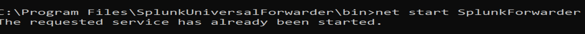
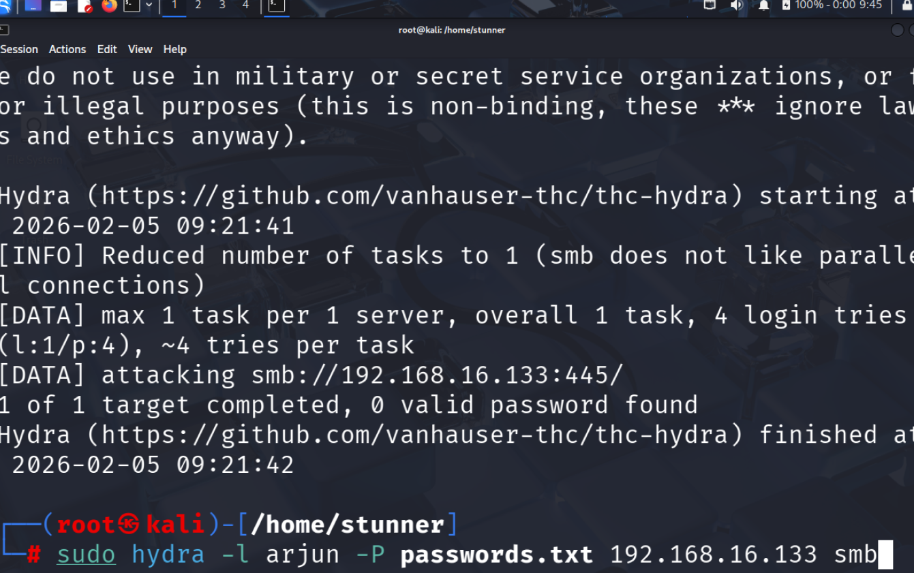
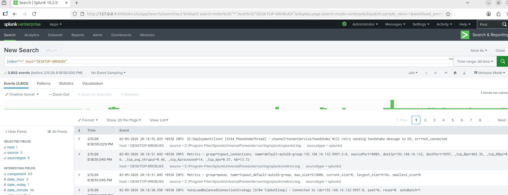
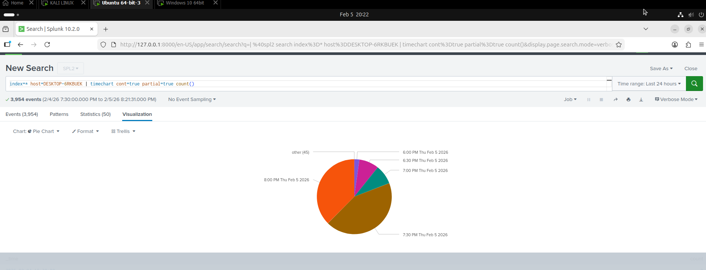
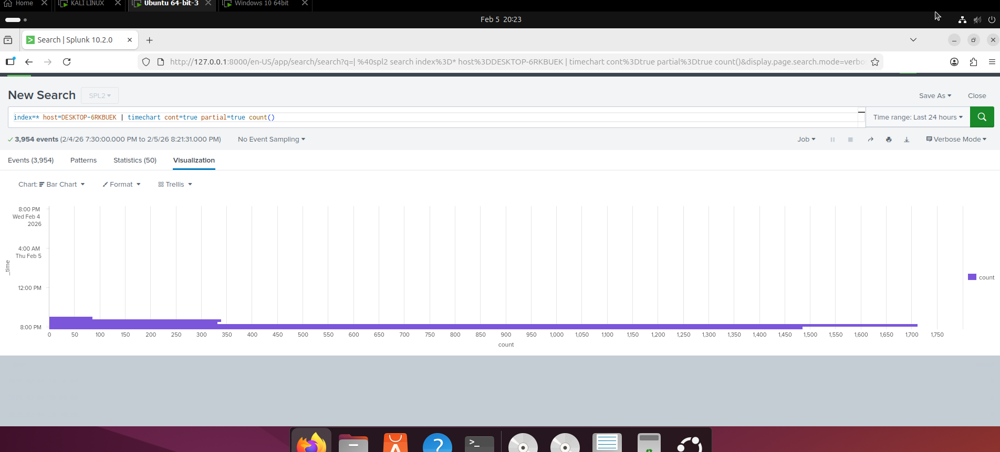

🛡️ SOC Automation & Brute Force Detection Lab
This project demonstrates the setup of a SIEM (Splunk) environment to detect Brute Force attacks on a Windows machine from a Kali Linux attacker.
🚀 Overview
The goal of this lab is to configure a complete log pipeline:
Target: Windows 10 (Generating Security Logs)
Forwarder: Splunk Universal Forwarder (Sending logs)
SIEM: Splunk Enterprise on Ubuntu (Indexing & Visualizing)
Attacker: Kali Linux (Executing Brute Force using Hydra)
🛠️ Step-by-Step Implementation
Step 1: Configuring Windows Auditing
To capture logon events, I enabled the audit policy on the Windows machine.
Command: auditpol /set /subcategory:"Logon" /success:enable /failure:enable

Screenshot:   
Step 2: Forwarding Logs to Splunk
I installed the Splunk Universal Forwarder and configured it to monitor security logs and send them to the Ubuntu SIEM server (Port 9997).

Service Status:  

Step 3: Attacking the Target (Hydra)
Using Kali Linux, I performed a simulated Brute Force attack against the Windows machine to generate failure events (EventCode 4625).
Attack Tool: Hydra

Screenshot:  

Step 4: Analyzing Logs in Splunk
The logs were successfully ingested into Splunk on Ubuntu. I used SPL (Splunk Processing Language) to filter the attack data.
Event Count: Over 1,800 security events ingested.

Screenshot:  

Step 5: Visualization & Insights
I created a visualization to track the volume of logs and identify the attack patterns.
SPL Query: index="*" host="DESKTOP-6RKBUEK" | stats count by host

Screenshot:

📈 Key Findings
Successfully detected multiple failed login attempts from a single IP address.
Real-time monitoring allowed for quick identification of the Brute Force pattern.
Verified that the Splunk Universal Forwarder is an efficient tool for remote log collection.
